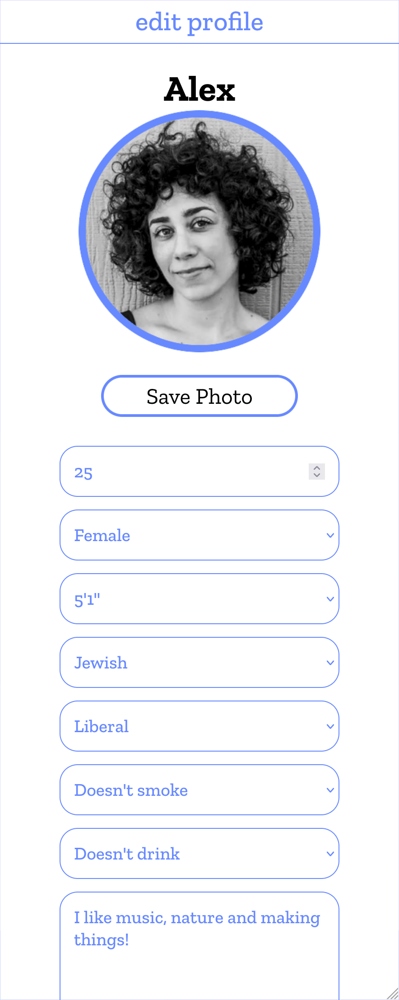
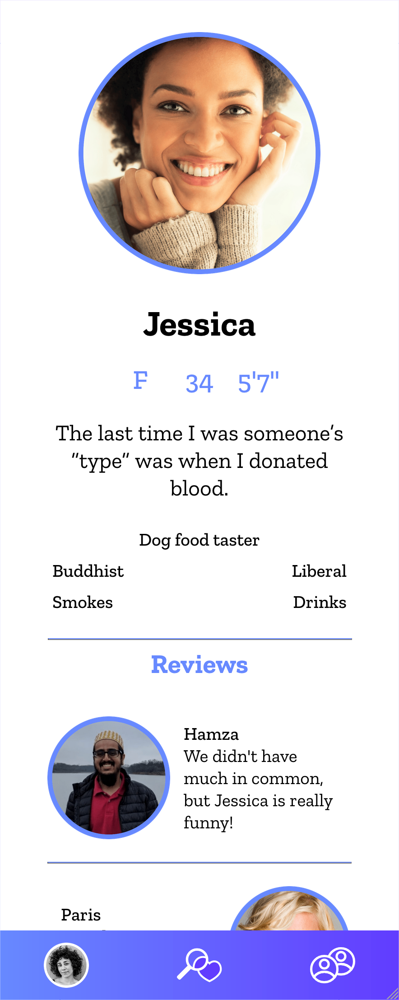
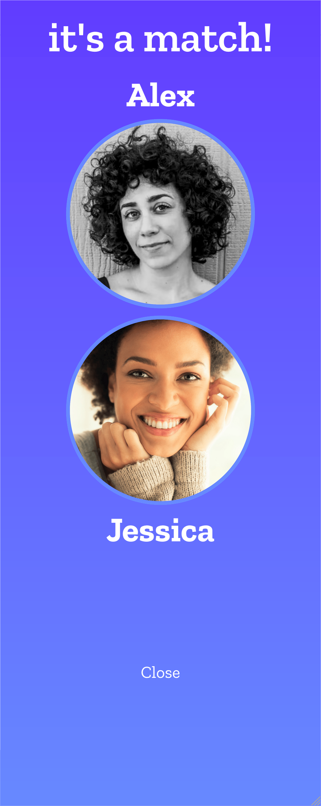
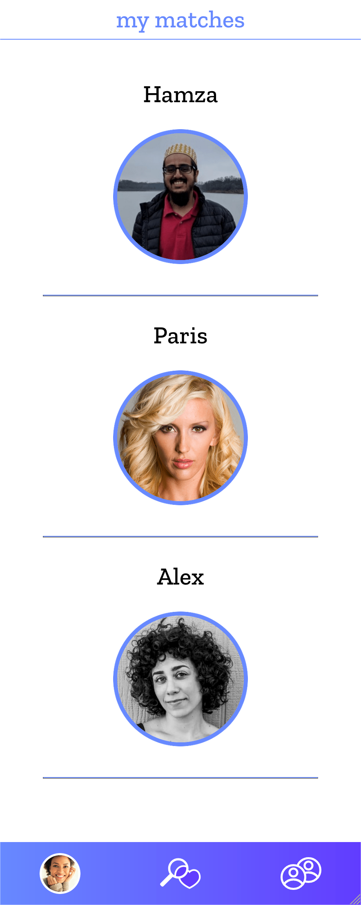

# Ghostbusters

## Description
An app which allows users to find potential matches and review their dates.

## Deployed App
[Ghostbusters](https://agile-peak-65135.herokuapp.com/)
  
## Table of Contents
- [Screenshot](#screenshot)
- [Usage](#usage)
- [Contributing](#contributing)
- [License](#license)
  
## Screenshot

    

  
## Usage
Sign up with first name, email address, and password. Click the profile icon to choose a photo and Save Photo to upload it. Fill out all the fields for profile, hit next, then fill out the fields for preferences. Use the explore page, indicated by the middle icon on the purple bar, to view potential matches. Click the photo to see further details about the perso, including reviews about them. Decide whether or not to "like" the person by clicking the broken heart or heart. When you have a match, you can view them by clicking the rightmost button on the purple bar. You can click on the match to view their profile and add a review. View your own profile by clicking your photo in the purple bar. You can edit your profile and preferences or log out.

### Backend Setup (DynamoDB)
- Set `AWS_REGION`, `AWS_ACCESS_KEY_ID`, and `AWS_SECRET_ACCESS_KEY` in your environment. Use `DYNAMODB_ENDPOINT` to target a local emulator (for example, `http://localhost:8000`).
- Create a table for users (default name `GhostbustersUsers`) with a partition key `_id` (`String`). Configure the table name via `USERS_TABLE`.
- (Optional but recommended) Add a GSI on the `email` attribute named `email-index` and expose it with `USERS_EMAIL_INDEX`.
- Start the API with `npm run start` from the `server` directory once the table is available.
- Seed sample users with `node server/seeders/seed.js` after configuring the table and credentials.

### Backend Deployment (AWS Lambda)
- The Express/Apollo server now runs behind an AWS Lambda function (API Gateway proxy). The Lambda entry point is exported from `server/lambda.js` as `lambda.handler`.
- Build the container image with the provided Lambda-compatible `Dockerfile`:
  - `docker build -t ghostbusters-backend server`
  - `docker tag ghostbusters-backend:latest <aws_account_id>.dkr.ecr.<region>.amazonaws.com/ghostbusters-backend:latest`
  - `docker push <aws_account_id>.dkr.ecr.<region>.amazonaws.com/ghostbusters-backend:latest`
- Create or update the Lambda function to use the pushed container image. Expose it through an HTTP API Gateway with a default proxy route so that `/graphql`, `/healthz`, and static fallbacks map correctly.
- Environment variables from the previous Fargate setup continue to apply (for example `USERS_TABLE`, `USERS_EMAIL_INDEX`, authentication secrets, etc.). Configure them on the Lambda function.
- Run `npm test` (or `npm --prefix server test`) before deploying to confirm the Lambda handler and Express bridge pass the integration checks.

### Frontend Configuration
- When hosting the React bundle from static storage (for example, S3) set `REACT_APP_GRAPHQL_URI` to the fully qualified GraphQL endpoint for the backend (e.g. `https://api.example.com/graphql`).
- Alternatively, set `REACT_APP_BACKEND_URL` to the backend origin (e.g. `https://api.example.com`) and `REACT_APP_GRAPHQL_PATH` if the route differs from the default `/graphql`.
- Without these variables the client falls back to `/graphql`, which only works when the frontend and backend share the same origin.

## Contributing
[Justin Watkins](https://github.com/JWatkins28), [Rashida Kapadia](https://github.com/rashida53), [Jenny Blacutt](https://github.com/itsjennyb), [Alex Berger](https://github.com/aberger3647)

## License
Learn more about [MIT](https://choosealicense.com/licenses/mit/).
